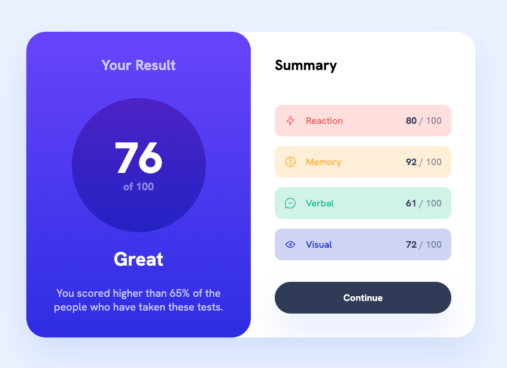

# Frontend Mentor - Results summary component

## Welcome! 👋

This is a solution to the [Results summary component challenge on Frontend Mentor](https://www.frontendmentor.io/challenges/results-summary-component-CE_K6s0maV).

### Screenshot

### Links

- Solution URL: [Github code repo](https://github.com/lastiwan89/fem-result-summary-new-js)
- Live Site URL: [Netlify](https://your-live-site-url.com)

## My process

### Built with

- Semantic HTML5 markup
- a simple javascript setup
- Sass
- Flexbox and grid combination

**Note: I'm using just html and simple css and not using media queries**

### Continued development

please leave review in my github profile

## Author

- Frontend Mentor - [@lastiwan89](https://www.frontendmentor.io/profile/lastiwan89)

**Have fun building!** 🚀
